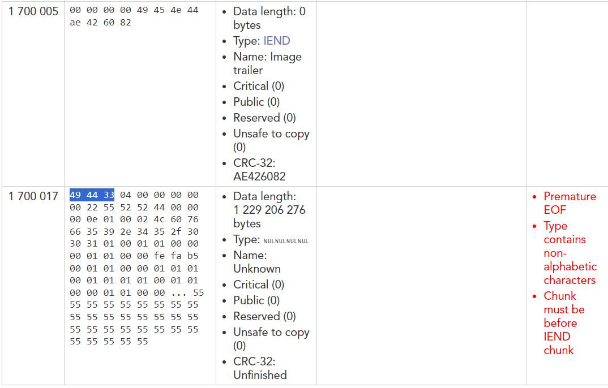
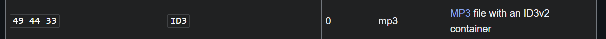
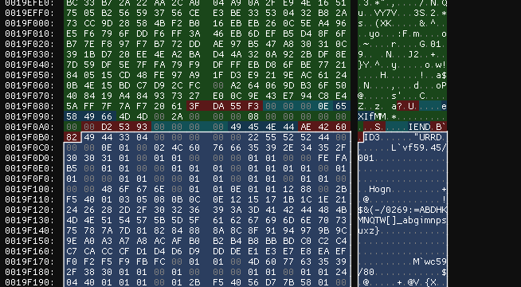
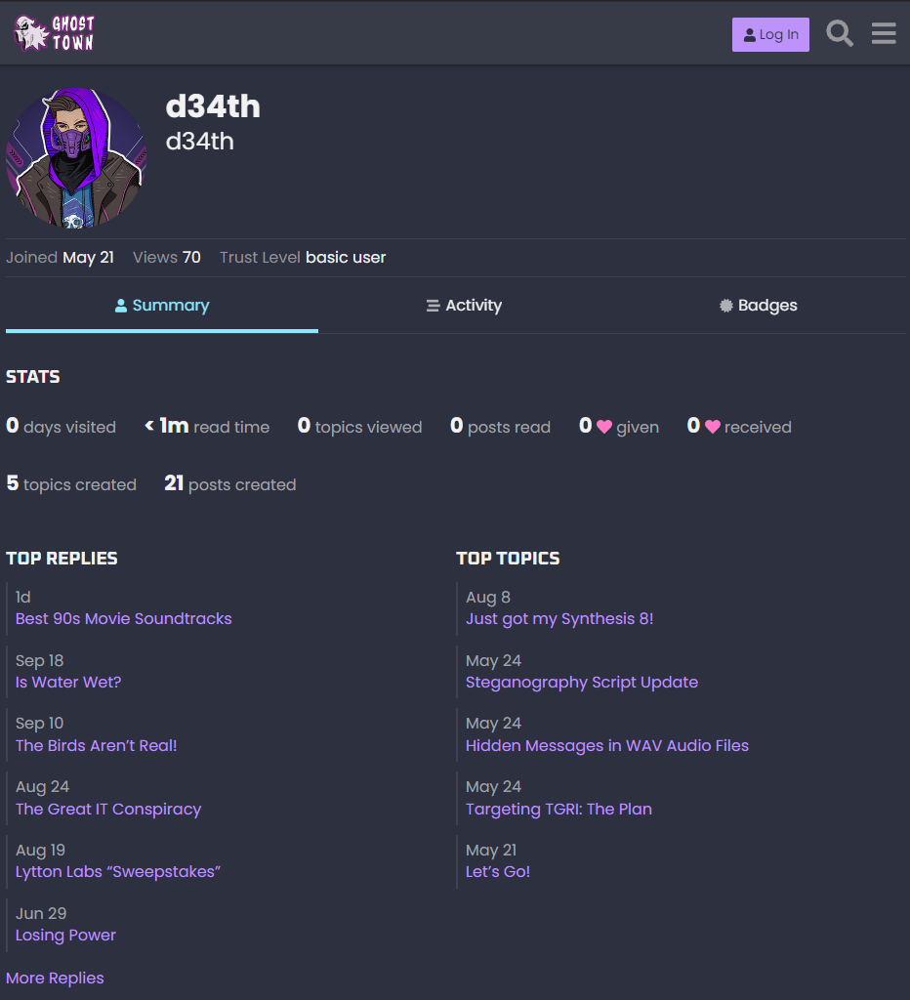
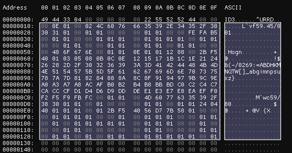

# electric_soldiers (steganography)
writeup by kretschs

> **Description**\
> "We stumbled across this image from `d34th` that might indicate how DEADFACE plans to sneak stolen information through various networks without detection. According to Ghost Town, `d34th` has been refining his process for embedding hidden information in various files. 
> 
> See if you can uncover any hidden information in this image. Submit the flag as `flag{flag-text}`."

We are given this image: 


## Part 1: the image
I ran `pngcheck` on the provided image:
```
electricsoldiers.png  additional data after IEND chunk
ERROR: electricsoldiers.png
```
Then I used [this tool](https://www.nayuki.io/page/png-file-chunk-inspector) to take a look at the chunks:
\
There is clearly a lot of stuff after what should be the end of the png data. If we look up just what is highlighted in a list of file signatures like [this one](https://en.wikipedia.org/wiki/List_of_file_signatures) we find out that it's an mp3. 
\
If we load `electricsoldiers.png` into a hex editor and select everything after the png IEND chunk we can save that data as an mp3. 


## Part 2: the mp3

Now we have a playable mp3 file. I was worried I would have to figure out something with the lyrics (hard to make out) and got stumped for a bit. I tried spectral analysis but there wasn't anything there. When I came back to it, I reread the challenge and saw something about "Ghost Town."

#### Ghost Town

I found a link to Ghost town in the description of another challenge. From there I could search `d34th` and find a matching profile.
\
I saw the topics related to steganography and read them. 

In "Steganography Script Update", we learn that the message is encoded in the Least Significant Bit (LSB) and its padded with spaces. This got me unstuck.

## Part 3: LSB

Back in the hex editor, we can look at the start of the mp3. 
\
Then I copied the data that looked like it wasn't part of the header and used [CyberChef](<https://cyberchef.org/#recipe=From_Hex('Auto')To_Binary('Space',8)>) to convert it to binary. This will be what our script will run on. 

My script:
```python
def get_lsb(binary_str):
    # Split the string
    binary_vals = binary_str.split()
    
    # Extract the lsb from each byte
    lsb_list = [binary[-1] for binary in binary_vals]
    
    # Return the lsbs as a string
    return ''.join(lsb_list)

# Binary string inout
binary_str = str(input("Enter binary: "))


lsb_result = get_lsb(binary_str)

print(f"Least Significant Bits: {lsb_result}")
```

After throwing the output back into [CyberChef](<https://cyberchef.org/#recipe=From_Binary('Space',8)>) to convert from binary we have our flag!